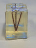
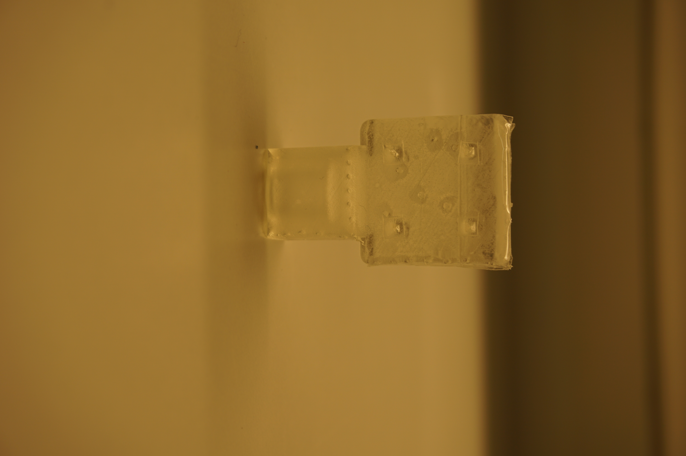
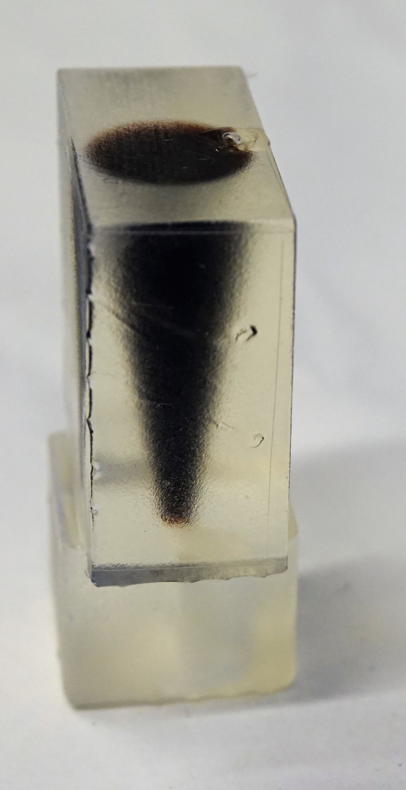

# Phantoms

Here, we describe the phantoms being used during the MPI measurements. The phantoms are all printed with the stereolithography 3D printing technique. All phantoms share the same robot mount defining the coordinate system. The robot mount is fixed in positive X direction. The flat side marks the positive Z direction. Poistive Y direction is then defined by right hand rule.

You can download the phantoms construction files in the format .SLDPRT, .STL and .STEP.

## Resolution Phantom

The resolution phantom consits of 5 tubes filled with **Perimag** featuring a concentration of **50 mmol**.
The 5 tubes have a common origin on one side of the phantom. From there the extend in different angles from this origin within the XY and the YZ plane. As the imaging system features the strong gradient in Z direction the angles in the YZ plane are chosen smaller (**10 deg and 15 deg**) than in XY direction (**20 deg and 30 deg**).
By chosing different planes, one can determine the capable resolution due to different distances of the tubes.

### CAD Data Resolution Phantom

[SolidWorks Part File](./phantoms/resolutionPhantom/Phantom1_Resolution.SLDPRT)
[STL File](./phantoms/resolutionPhantom/Phantom1_Resolution.STL)
[STEP File](./phantoms/resolutionPhantom/Phantom1_Resolution.STEP)

## Concentration Phantom

The second phantom consists of 8 cubes of 2mm edge length resulting in **8µl volume** each. The distance of the cubes are **12 mm** between centers (10 mm between edges)  within the XY plane and 6 between centers (4 mm between corners) within Z direction.
We name the sample chambers 1 to 8 starting with the top layer on the front left (positive X and Y direction), counting clockwise. Then starting with the lower layer with number 5 on the front left (positive X and Y direction), counting clockwise.
The concentrations in the 8 sample chambers are the following:

| Num. | Concentration |
| ------------------ | ------ |
| 1 | 100 mmol/l |
| 2 | 66.6 mmol/l |
| 3 | 44.4 mmol/l |
| 4 | 29.6 mmol/l |
| 5 | 19.7 mmol/l |
| 6 | 13.1 mmol/l |
| 7 | 8.77 mmol/l |
| 8 | 5.85 mmol/l |

### CAD Data Concentration Phantom

[SolidWorks Part File](./phantoms/concentrationPhantom/Phantom2_Concentration.SLDPRT)
[STL File](./phantoms/concentrationPhantom/Phantom2_Concentration.STL)
[STEP File](./phantoms/concentrationPhantom/Phantom2_Concentration.STEP)

## Shape Phantom

To resemble a well known shape a cone defined by a **1 mm** radius tip and an apex angle of **10 deg** and a hight of **22 mm**. The total volume is **683.9 µL**. As tracer **Perimag** in a concentration of **50 mmol/L** were used. The phantom can be rendered in 3D resemling the cone or can be cut in a layer view to see either a circle (YZ plane) or a triangle with flattened tip (XZ or XY plane)

### CAD Data Shape Phantom

[SolidWorks Part File](./phantoms/shapePhantom/Phantom3_Shape.SLDPRT)
[STL File](./phantoms/shapePhantom/Phantom3_Shape.STL)
[STEP File](./phantoms/shapePhantom/Phantom3_Shape.STEP)
