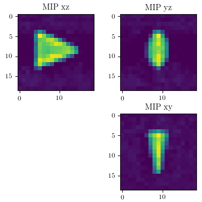
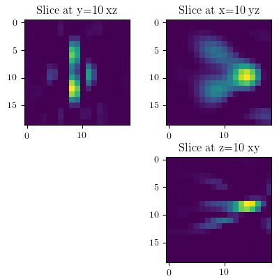
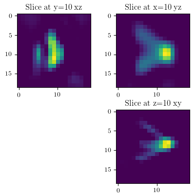
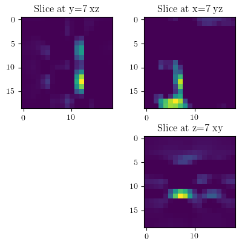
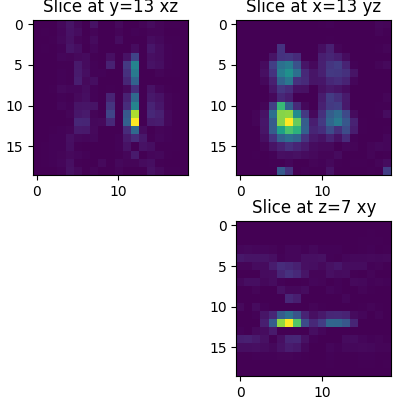
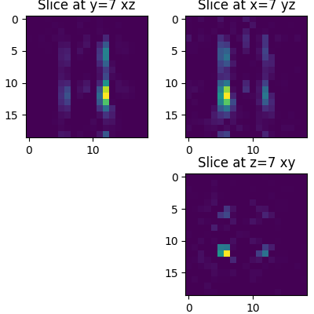
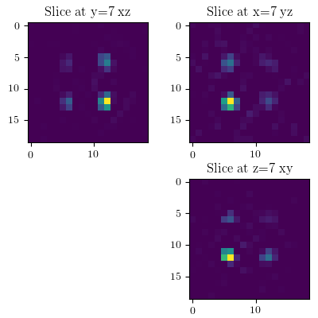

### Reconstructions

Here we show you how the different phantom reconstructions for 1D sequence, 2D sequence and 3D seqguence look like.

## Shape Phantom Reconstructions

## Reolution Phantom Reconstruction

## Concentration Phantom Reconstruction

