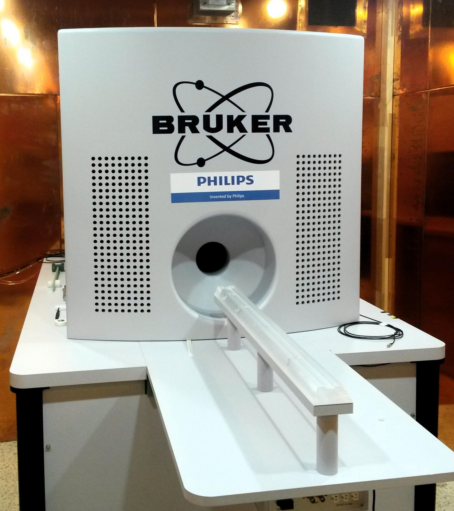

# MPI Scanners

Here we describe the MPI scanners being used to acquire the MPI data

## Bruker Preclinical MPI Scanner

The preclinical MPI scanner from Bruker has a 11.8 cm bore and is equipped
with a fully 3D send/receive system and 3D focus fields allowing for
flexible measurement sequencies. The system parameters are given below

| Parameter                     |     Value                           |
| ------------------------------| ------------------------------------|
| Scanner Bore Diameter         |   118 mm                            |
| MaxDrive-Field Amplitude      |   14 mT x 14 mT x 14 mT             |
| MaxFocus-Field Amplitude      |   17 mT x 17 mT x 42 mT             |
| Drive-Field Frequency         |   2.5MHz/102 x 2.5MHz/96 x 2.5MHz/99|
| Max Selection-Field Gradient  |   -1.25 T/m x -1.25 T/m x 2.5 T/m   |
| Repetition Time               |    38.4 $\mu$s - 21.54 ms           |

 
